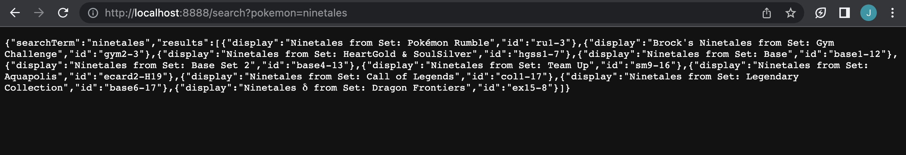
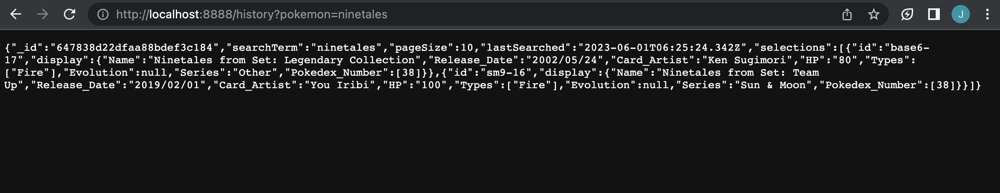

# SearchPokemonApp
Users are able to search through different card sets pertaining to a specific Pokémon in order to find a singular card. App can return either the details of the chosen card or the search history.

## About the Project

## Features
Prior to Working with the Application:
- Run 'npm install' on pokemon-api
- Run 'npm install' on pokemon-application
- Run 'npm run dev' comamand to start the application

### Search Pokemon Endpoint
##### localhost:8888/search?pokemon='pokemon_name'
example: localhost:8888/search?pokemon=ninetales
Endpoint returns a JSON response of different cards from different sets. The browser displays the card name + the set it's from and the unique identifer. 

  
  

### Pokemon Details Endpoint
##### localhost:8888/search/id/details?pokemon='pokemon_name'
example: localhost:8888/search/sm9-16/details?pokemon=ninetales
Endpoint returns a JSON response of the details pertaining to one specifc card. The broswer displays lots of minor details pertaining to the card.

  
  

### Search History - One Pokemon
##### localhost:8888/history?pokemon='pokemon_name'
example: localhost:8888/history?pokemon=ninetales
Endpoint returns a JSON response of all the search history on the database pertaining to a specific pokemon.

  

### Search History - General
##### localhost:8888/history
example: localhost:8888/history
Endpoint returns a JSON response of all the search history on the database.

  

## Built Using
- JavaScript
- NodeJS
- Express.JS
- MongoDB
- SearchPokemonAPI (personally created)
- VSCode
