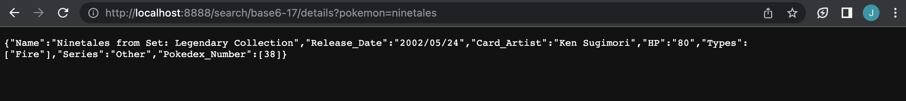

# SearchPokemonApp

## About the Project

## Features
Prior to Working with the Application:
- Run 'npm install' on pokemon-api
- Run 'npm install' on pokemon-application
- Run 'npm run dev' comamand to start the application

### Search Pokemon Endpoint
##### localhost:8888/search?pokemon='pokemon_name'
example: localhost:8888/search?pokemon=ninetales

  
  

### Pokemon Details Endpoint
##### localhost:8888/search/id/details?pokemon='pokemon_name'
example: localhost:8888/search/sm9-16/details?pokemon=ninetales

  
  

### Search History - One Pokemon
##### localhost:8888/history?pokemon='pokemon_name'
example: localhost:8888/history?pokemon=ninetales

  

### Search History - General
##### localhost:8888/history
example: localhost:8888/history

  

## Built Using
- JavaScript
- NodeJS
- Express.JS
- MongoDB
- SearchPokemonAPI (personally created)
- VSCode
